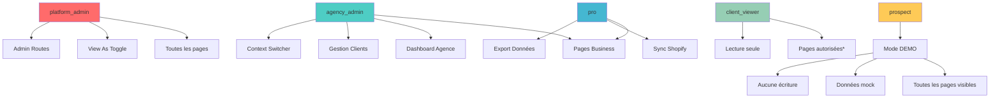

# 📌 Rapport Complet sur les Accès et Autorisations - KAPEHI

## Table des Matières
1. [Rôles définis dans le système](#1-rôles-définis-dans-le-système)
2. [Modes d'environnement](#2-modes-denvironnement)
3. [Vérités côté serveur](#3-vérités-côté-serveur)
4. [Chemins et accès par rôle](#4-chemins-et-accès-par-rôle)
5. [Vérités & limitations en mode Demo](#5-vérités--limitations-en-mode-demo)
6. [Switcher & contextes](#6-switcher--contextes)
7. [Sécurité & garde-fous](#7-sécurité--garde-fous)
8. [Diagramme / schéma](#8-diagramme--schéma)

---

## 1. Rôles définis dans le système

### 1.1 Hiérarchie des rôles

| Rôle | Description métier | Exemple d'utilisateur type | Niveau d'accès |
|------|-------------------|---------------------------|----------------|
| `prospect` | Utilisateur en phase de découverte | Entrepreneur testant l'outil | Lecture seule, données mock |
| `pro` | Client payant avec accès complet | E-commerçant avec abonnement | Lecture/écriture, sync Shopify |
| `client_viewer` | Accès limité aux données client | Employé d'un client d'agence | Lecture seule sur pages autorisées |
| `agency_admin` | Administrateur d'agence | Directeur d'agence marketing | Gestion clients + accès agence |
| `tenant_admin` | Administrateur de tenant | Responsable technique client | Administration tenant |
| `platform_admin` | Super-administrateur | Équipe technique KAPEHI | Accès global + View As |

### 1.2 Définition technique des rôles

```typescript
export type ViewAsRole = 'pro' | 'agency_admin' | 'client_viewer' | 'platform_admin';

// Contrainte base de données
CHECK (role IN ('prospect', 'pro', 'agency_admin', 'client_viewer', 'tenant_admin', 'platform_admin'))
```

---

## 2. Modes d'environnement

### 2.1 Mode DEMO
- **Données** : Mock/simulées uniquement
- **Accès** : Lecture seule (`canWrite: false`)
- **Pages autorisées** : `["*"]` (toutes les pages visibles)
- **Limitations** : 
  - Pas de sync Shopify (`canSync: false`)
  - Pas d'export (`canExport: false`)
  - Bannières d'avertissement
- **Déclenchement** : Aucun tenant trouvé OU tenant de type `demo`

### 2.2 Mode ONBOARDING
- **Données** : Shopify connecté, sync limitée
- **Accès** : Écriture limitée
- **Pages autorisées** : Selon le plan/rôle
- **Limitations** : 
  - Mini-sync uniquement
  - Fonctionnalités bridées selon le plan
- **Déclenchement** : Shopify connecté MAIS pas de subscription active

### 2.3 Mode PRODUCTION
- **Données** : Sync complète Shopify
- **Accès** : Complet selon le rôle/plan
- **Pages autorisées** : Selon `allowed_pages` + plan
- **Limitations** : Aucune (selon plan)
- **Déclenchement** : Subscription active + Shopify connecté

### 2.4 Logique de détermination du mode

```sql
-- Fonction get_user_mode_extended
CASE 
  WHEN user_tenant_info IS NULL THEN 'DEMO'
  WHEN NOT user_tenant_info.shopify_connected THEN 'DEMO'
  WHEN subscription_info IS NULL THEN 'ONBOARDING'
  ELSE 'PRODUCTION'
END
```

---

## 3. Vérités côté serveur

### 3.1 Tables sources de vérité

| Table | Colonnes clés | Rôle dans l'autorisation |
|-------|---------------|-------------------------|
| `tenants` | `type`, `category`, `parent_tenant_id`, `shopify_connected` | Hiérarchie et mode |
| `tenants_users` | `role`, `allowed_pages`, `features` | Rôles et permissions ABAC |
| `subscriptions` | `status`, `plan_id` | Activation des fonctionnalités |
| `plans` | `features`, `price_monthly` | Fonctionnalités disponibles |
| `profiles` | `tenant_id` | Association utilisateur-tenant |

### 3.2 Calculs côté serveur vs client

#### Côté serveur (source de vérité)
- **RPC** : `get_user_mode_extended()` - Calcul du mode et des permissions
- **RLS** : Filtrage automatique des données par `tenant_id`
- **Vue** : `my_tenant_scope` - Scope hiérarchique agence/clients
- **Résolution contexte** : `resolveContext()` - Validation des accès tenant

#### Côté client (affichage uniquement)
- **Hook** : `useAppMode()` - Consommation des données serveur
- **Helper** : `hasPageAccess()` - Vérification d'affichage UI
- **Override** : `useViewAs()` - Simulation UI pour platform_admin

### 3.3 Règle "le front ne décide jamais"

```typescript
// ❌ INTERDIT - Logique métier côté client
if (user.role === 'admin') { allowAccess = true; }

// ✅ CORRECT - Consommation des données serveur
const { canWrite, hasPageAccess } = useAppMode();
if (canWrite && hasPageAccess('products')) { /* UI */ }
```

---

## 4. Chemins et accès par rôle

### 4.1 Tableau des accès par rôle

| Page/Action | prospect | pro | client_viewer | agency_admin | platform_admin |
|-------------|----------|-----|---------------|--------------|----------------|
| **Dashboard** | ✅ (demo) | ✅ | ✅ | ✅ | ✅ |
| **Préconisations Facebook** | ✅ (demo) | ✅ | 🔒* | ✅ | ✅ |
| **Suggestions IA** | ✅ (demo) | ✅ | 🔒* | ✅ | ✅ |
| **Audit Prix** | ✅ (demo) | ✅ | 🔒* | ✅ | ✅ |
| **Gestion Coûts** | ✅ (demo) | ✅ | 🔒* | ✅ | ✅ |
| **ROI Intelligence** | ✅ (demo) | ✅ | 🔒* | ✅ | ✅ |
| **Connexion Plateformes** | ❌ | ✅ | ❌ | ✅ | ✅ |
| **Dashboard Agence** | ❌ | ❌ | ❌ | ✅ | ✅ |
| **Gestion Clients** | ❌ | ❌ | ❌ | ✅ | ✅ |
| **Admin Agences** | ❌ | ❌ | ❌ | ❌ | ✅ |
| **Admin Système** | ❌ | ❌ | ❌ | ❌ | ✅ |

*🔒 = Selon `allowed_pages` configuré par l'agence*

### 4.2 Actions CRUD par rôle

| Action | prospect | pro | client_viewer | agency_admin | platform_admin |
|--------|----------|-----|---------------|--------------|----------------|
| **Lecture données** | ✅ (mock) | ✅ | ✅ (scope) | ✅ (scope) | ✅ (global) |
| **Écriture données** | ❌ | ✅ | ❌ | ✅ | ✅ |
| **Export données** | ❌ | ✅ | ❌ | ✅ | ✅ |
| **Sync Shopify** | ❌ | ✅ | ❌ | ✅ | ✅ |
| **Gestion utilisateurs** | ❌ | ❌ | ❌ | ✅ (clients) | ✅ (global) |
| **Configuration tenant** | ❌ | ✅ | ❌ | ✅ | ✅ |

### 4.3 Logique de navigation

```typescript
// MainLayout.tsx - Construction dynamique du menu
let navigation = [{ title: 'Dashboard', href: '/', icon: Home }];

if (hasPageAccess('campaigns') || hasPageAccess('*')) {
  navigation.push({ title: 'Préconisations Facebook', href: '/preconisations-facebook' });
}

if (isAgencyAdmin && hasPageAccess('clients')) {
  navigation.push({ title: 'Gestion Clients', href: '/clients' });
}

if (isPlatformAdmin) {
  navigation.push({ title: 'Admin Système', href: '/admin/system' });
}
```

---

## 5. Vérités & limitations en mode Demo

### 5.1 Données mock

```typescript
// Mode DEMO - Données simulées
{
  mode: 'DEMO',
  role: 'prospect',
  source: 'mock',
  tenant_id: null,
  allowed_pages: ['*'],  // Toutes les pages visibles
  capabilities: {
    canWrite: false,      // Écriture bloquée
    canExport: false,     // Export bloqué
    canSync: false        // Sync bloquée
  }
}
```

### 5.2 Actions bloquées

- **Écriture** : Tous les formulaires affichent "Action non autorisée en mode démo"
- **Sync** : Boutons de synchronisation désactivés
- **Export** : Fonctionnalités d'export masquées
- **Configuration** : Paramètres Shopify/Facebook en lecture seule

### 5.3 UX spécifique Demo

```typescript
// Bannières d'information
{isDemo && (
  <Card className="bg-gradient-to-r from-purple-50 to-blue-50">
    <h3>🎯 Mode Démonstration</h3>
    <p>Découvrez toutes les fonctionnalités avec des données simulées</p>
  </Card>
)}

// Blocage des actions
const handleSave = () => {
  if (!canWrite) {
    alert('Action non autorisée en mode démo');
    return;
  }
  // Logique de sauvegarde
};
```

---

## 6. Switcher & contextes

### 6.1 Fonctionnement du Context Switcher

#### Qui peut switcher ?
- `agency_admin` : Entre son agence et ses clients
- `platform_admin` : Entre tous les tenants

#### Logique de résolution
```typescript
// resolveContext.ts
export async function resolveContext(supabase, userId, requestedTenantId) {
  // 1. Récupérer les memberships utilisateur
  const memberships = await getMemberships(userId);
  
  // 2. Construire le scope accessible
  const myTenants = new Set(memberships.map(m => m.tenant_id));
  
  // 3. Si agency_admin, ajouter les clients enfants
  if (isAgencyAdmin) {
    const children = await getChildrenTenants(agencyId);
    children.forEach(child => myTenants.add(child.id));
  }
  
  // 4. Valider l'accès au tenant demandé
  if (!myTenants.has(requestedTenantId)) {
    throw new ContextError('TENANT_OUT_OF_SCOPE');
  }
}
```

### 6.2 View As (Platform Admin)

#### Conditions d'activation
```typescript
// AdminImpersonateToggle.tsx
if (!isRealPlatformAdmin || !isFeatureEnabled) {
  return null; // Toggle masqué
}

// Feature flag requis
VITE_FEATURE_VIEW_AS=true
```

#### Sécurité View As
- **Télémétrie** : Toutes les sessions View As sont tracées
- **Audit** : Logs avec `who`, `uiRole`, `tenantId`, `reason`, `duration`
- **Limitation** : Seuls les `platform_admin` réels peuvent l'utiliser
- **UI Override** : Simulation côté client uniquement, pas de modification serveur

```typescript
// Télémétrie View As
viewAsTelemetry.trackStart({
  userId: user?.id,
  userEmail: profile?.email,
  realRole: realRole,
  uiRole: role,
  tenantId,
  reason
});
```

---

## 7. Sécurité & garde-fous

### 7.1 Row Level Security (RLS)

#### Politiques par table
```sql
-- Tenants : Accès selon membership
CREATE POLICY "Users can read their tenants" ON tenants
FOR SELECT USING (
  EXISTS (
    SELECT 1 FROM tenants_users tu 
    WHERE tu.tenant_id = tenants.id 
    AND tu.user_id = auth.uid()
  )
);

-- Products : Scope hiérarchique
CREATE POLICY "Users can view their tenant scope products" ON products
FOR SELECT USING (tenant_id IN (SELECT tenant_id FROM my_tenant_scope));

-- Platform admin : Accès global via mode_overrides
CREATE POLICY "Platform admins can manage mode overrides" ON mode_overrides
FOR ALL USING (
  EXISTS (
    SELECT 1 FROM tenants_users tu 
    WHERE tu.user_id = auth.uid()
    AND tu.role = 'platform_admin'
  )
);
```

### 7.2 Vue hiérarchique

```sql
-- my_tenant_scope : Calcul automatique du scope accessible
CREATE VIEW my_tenant_scope AS
SELECT DISTINCT t_child.id as tenant_id
FROM tenants t_child
JOIN tenants_users m_root ON m_root.user_id = auth.uid()
JOIN tenants t_root ON t_root.id = m_root.tenant_id
WHERE
  -- Son propre tenant
  t_child.id = t_root.id
  -- OU les clients si c'est une agence
  OR (t_root.category = 'agency' AND t_child.parent_tenant_id = t_root.id)
  -- OU si platform_admin, tous les tenants (via policy séparée)
```

### 7.3 Audit et traçabilité

#### Routes admin avec Service Role
```typescript
// Supabase Edge Functions avec clé service
const supabaseAdmin = createClient(
  SUPABASE_URL,
  SUPABASE_SERVICE_ROLE_KEY // Accès privilégié
);
```

#### Traces View As
```typescript
interface ViewAsTelemetry {
  who: string;           // Email de l'admin
  uiRole: ViewAsRole;    // Rôle simulé
  tenantUI?: string;     // Tenant ciblé
  startedAt: Date;       // Début de session
  endedAt?: Date;        // Fin de session
  reason?: string;       // Justification
}
```

### 7.4 Protection contre les écritures Demo

```typescript
// Vérification systématique avant écriture
const handleSave = async () => {
  if (!canWrite) {
    alert('Action non autorisée en mode démo');
    return;
  }
  
  // Double vérification côté serveur via RLS
  const { error } = await supabase
    .from('products')
    .insert(data); // Échouera si RLS bloque
    
  if (error) {
    console.error('Écriture bloquée par RLS:', error);
  }
};
```

---

## 8. Diagramme / schéma

### 8.1 Schéma visuel des accès



### 8.2 Matrice des permissions

| Rôle / Fonctionnalité | Dashboard | Business Pages | Agence Pages | Admin Pages | Écriture | Export | Sync | Context Switch | View As |
|----------------------|-----------|----------------|--------------|-------------|----------|--------|------|----------------|---------|
| **prospect** | ✅ (demo) | ✅ (demo) | ❌ | ❌ | ❌ | ❌ | ❌ | ❌ | ❌ |
| **pro** | ✅ | ✅ | ❌ | ❌ | ✅ | ✅ | ✅ | ❌ | ❌ |
| **client_viewer** | ✅ | 🔒* | ❌ | ❌ | ❌ | ❌ | ❌ | ❌ | ❌ |
| **agency_admin** | ✅ | ✅ | ✅ | ❌ | ✅ | ✅ | ✅ | ✅ | ❌ |
| **platform_admin** | ✅ | ✅ | ✅ | ✅ | ✅ | ✅ | ✅ | ✅ | ✅ |

*🔒 = Selon configuration `allowed_pages`*

### 8.3 Flux de détermination des accès

```mermaid
flowchart TD
    Start([Utilisateur se connecte]) --> GetUser[Récupération profil utilisateur]
    GetUser --> GetTenants[Récupération tenants_users]
    GetTenants --> HasTenant{A des tenants ?}
    
    HasTenant -->|Non| DemoMode[Mode DEMO<br/>prospect<br/>allowed_pages: ['*']<br/>canWrite: false]
    
    HasTenant -->|Oui| CheckShopify{Shopify connecté ?}
    CheckShopify -->|Non| DemoMode
    
    CheckShopify -->|Oui| CheckSub{Subscription active ?}
    CheckSub -->|Non| OnboardingMode[Mode ONBOARDING<br/>Fonctionnalités limitées]
    CheckSub -->|Oui| ProductionMode[Mode PRODUCTION<br/>Accès complet selon rôle]
    
    ProductionMode --> CheckRole{Quel rôle ?}
    CheckRole -->|platform_admin| PlatformAccess[Accès global<br/>View As disponible]
    CheckRole -->|agency_admin| AgencyAccess[Accès agence + clients<br/>Context switcher]
    CheckRole -->|pro| ProAccess[Accès tenant<br/>Écriture/Sync]
    CheckRole -->|client_viewer| ViewerAccess[Lecture seule<br/>Pages configurées]
    
    style DemoMode fill:#feca57
    style OnboardingMode fill:#ff9ff3
    style ProductionMode fill:#54a0ff
    style PlatformAccess fill:#ff6b6b
    style AgencyAccess fill:#4ecdc4
    style ProAccess fill:#45b7d1
    style ViewerAccess fill:#96ceb4
```

---

## 🎯 Résumé exécutif

### Points clés de sécurité
1. **Source de vérité serveur** : Toutes les permissions sont calculées côté serveur via RPC
2. **RLS systématique** : Chaque table est protégée par des politiques Row Level Security
3. **Hiérarchie respectée** : Les agences accèdent automatiquement à leurs clients via `my_tenant_scope`
4. **Audit complet** : Toutes les actions View As sont tracées avec télémétrie
5. **Mode Demo sécurisé** : Aucune écriture possible, données mock uniquement

### Architecture RBAC/ABAC
- **RBAC** : Rôles définis (`prospect`, `pro`, `agency_admin`, etc.)
- **ABAC** : Attributs `allowed_pages` et `features` par utilisateur/tenant
- **Hiérarchique** : Agences → Clients avec héritage des permissions
- **Contextuel** : Modes DEMO/ONBOARDING/PRODUCTION selon l'état du tenant

### Conformité et gouvernance
- ✅ Principe de moindre privilège respecté
- ✅ Séparation des responsabilités (serveur/client)
- ✅ Traçabilité complète des accès privilégiés
- ✅ Protection contre l'escalade de privilèges
- ✅ Isolation des données par tenant (RLS)

---

*Rapport généré le $(date) - Version 1.0*
*Système KAPEHI - Architecture Multi-tenant RBAC/ABAC*